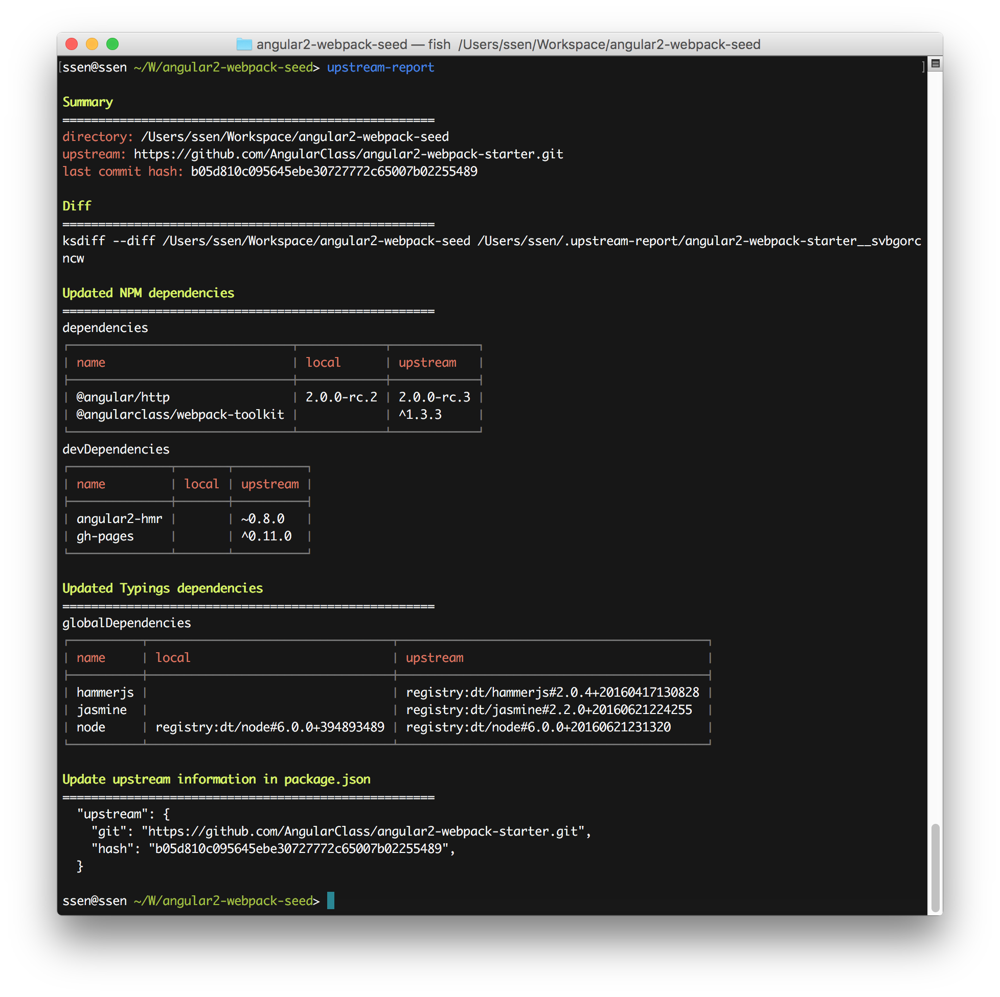

# Warning
This module is not completely.

This module tested by...

- OS X 10.11
- Node.js 6.2.2

# Install

```
npm install upstream-report -g
```

# Basic

## Add upstream project information to your 'package.json' file

package.json

```json
{
  "upstream": {
    "git": "https://github.com/AngularClass/angular2-webpack-starter.git"
  }
}
```

## Get report

```sh
$ cd /your/project/path
$ upstream-report

# OR

$ upstream-report /your/project/path
```

## And update your project

You should get report like this...



Do update your project with refer to the report.

> Do not miss update "upstream" information to your `package.json` file
